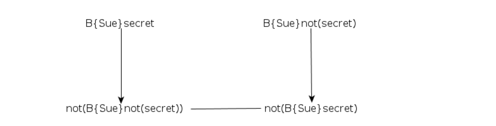
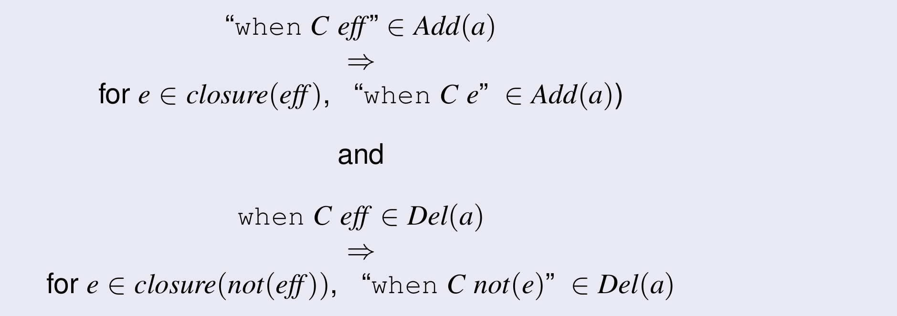

# Epistemic Planning

## Classical Planning
+ Deterministic events
+ Environments change only as the result of an action
+ Perfect knowledge
    * omniscience
+ Single actor
    * omnipotence

## Epistemic Planning
+ modeling knowledge or belief
    * drop the assumption of perfect knowledge 
        - partially observable
        - why
            + ~~no autonomous entity ever has it~~
            + ~~many hard problems in autonomy & AI involve finding out information that we don’t know~~
                * ~~locating survivors in a disaster and providing them with aid~~
            + ~~can never tell everything that another ‘agent’ (human or artificial) knows~~
    * different actors have different beliefs or knowledge about the environment and each other
        - (start to) drop the assumption of single actor (but only a bit)
            + multi-agent
                * but still single controller
    * may not change the environment
        - can have epistemic/doxastic actions
            + may not be physical/ontic actions
+ epistemic planning definition
    * same definition as classical/non-deterministic/MDP planning
    * However, the state space is over sets of belief atoms φ, rather than over just sets of atoms.
    *  normal atom vs epistemic atom
        - epistemic atom can have
            + the absence of believe of the seret
            + the belief of the opposite/negation of the secret
            + 
+ problems
    * belief update problem
        - How to update the state when an epistemic atom becomes true/false
        - 
    * uncertain firing problem.
        - How to update the state when an agent is aware that an event may have happened, but is unsure.
        - 
    * closure problem
        - How to update the state to ensure that it is complete.
        - 
+ some concepts
    * _conditional effects_
    * _open-world modelling_
        - break the _closed-world assumption_
            + use two atoms for each concept
                * one representing it being true; one representing it being false
                    - _secret_, _neg_secret_, _not(secret)_, _not(neg_secret)_
+ Compiling away epistemic atoms
    * Ground the epistemic atoms
        - epistemic -> propositional
    * Ground the propositional atoms
        - For every propositional atom, create its explicit negation.
    * Add new conditional effects
        - For every conditional effect of an action, add a (possibly empty) set of new conditional effects that preserve the semantics of the epistemic actions
+ complexity
    * exponentially-larger
        - the resulting classical planning problem is a PSPACE problem
            + can use classical search techniques to solve this compilations quickly
                * like FOND planning