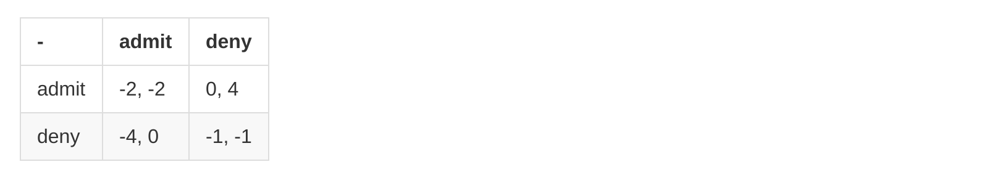
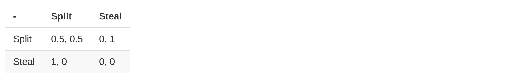
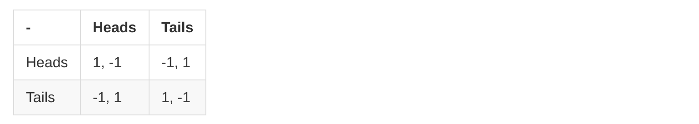
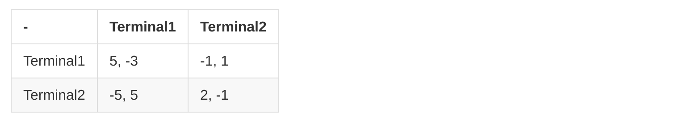

# Game Theory

+ Prisoner's dilemma
    * a non-zero-sum game
        - 
    * __dominant strategy__
        - weakly dominant strategy
        - strictly dominant strategy 
        - produces the highest payoff of any strategy available for every possible action by the other players.
        - Predictions are particularly easy when there are dominant strategies.
            + An individual __does not have to make any predictions about what other players might do__, and still has a well-defined best strategy.
+ __Nash Equilibrium__
    * pure strategy Nash equilibrium
        - each player’s strategy is a best response (results in the highest available payoff) against the equilibrium strategies of the other players.
            + __!= dominant strategy__
                * only requires that the action taken by each agent be best against the actual equilibrium actions taken by the other players, and not necessarily against all possible actions of the other players.
                * A profile of dominant strategies is a Nash equilibrium but not vice versa.
        - A Nash equilibrium has the nice property that it is __stable__.
            + No player regrets having played the action that he or she played in a Nash equilibrium.
    * poviding everyone is rational (can make the best choice), if all of the other play the Nash Equilibrium, then a player can not make better choice than not playing the Nash Equilibrium
        - ~~证明了平衡不动点解是存在的,却不能指出如何去找到~~
        - ~~规模太小 (两三个节点)~~
            + ~~这个假设的不完善处，可能比假设大家都是合作的更严重。~~
                * ~~一个庞大社会里的人极不可能全部都是合作的，非合作的情况通常在庞大对象的情形中更普遍，而在两三个节点的小规模经济中倒反而影响较小。既然改了合作前提为非合作前提，却仍然停留在两三个节点的小规模博弈论中，这是一个不可忽视的缺陷。~~
        - ~~找到纳什均衡点几乎不可能~~
            + ~~纳什均衡属于NP问题~~
        - ~~不过在参与者匿名的情况下，则仅需多项式时间即可逼近纳什均衡~~
+ An Advertising Game
    * 
+ Split or Steal
    * 
*  Randomization and Mixed Strategy
    + indifferent
        * no way to be exploited
            + Matching Pennies
                * 
            + Security Games
                * 
                + make the attacker don't care which to attack