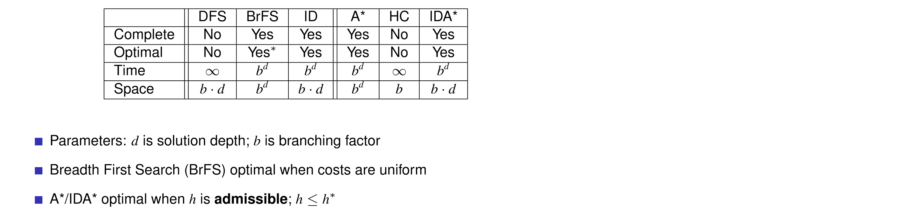

# Search Algorithms

## State Model
+ state space
    * finite and discrete
+ a initial state
+ a __set__ of goal states
+ applicable actions for each state
+ deterministic transition function s' = f(a, s)
+ cost c(a, s)

## Classical Planning
+ Basic State Model
    * directed graphs
+ search algo
    * Blind search vs. Heuristic (or informed) search
        - Blind search
            + DFS
            + BFS
            + Uniform cost (Dijkstra)
            + Iterative Deepening (ID)
        - Heuristic search
            + A*
            + IDA*
            + Hill Climbing
            + Best First
            + WA*
            + DFS B&B
            + LRTA*
    * Systematic search vs. Local search
        - Systematic search
            + consider a large number of search nodes simultaneously
        - Local search
            + work with one (or a few) candidate solutions (search nodes) at a time
        - can overlap
            + hill-climbing
    + when to use?
        * satisfying planning
            - Heuristic >> Blind
            - Systematic ≈  Local
        * optimal planning
            - Heuristic > Blind
            - has to be Systematic

## Terminology
+ Search node
+ Path cost
+ Optimal cost
+ Node expansion
+ Search strategy
+ Open list (Frontier)
+ Closed list (explored set)
    * only used in graph search
        - not in tree search

## world states vs. search states
+ World state
    * Situation in the world modelled by the planning task
+ Search state
    * Subproblem remaining to be solved

## Progression vs. Regression
+ progression
    * forward
    * default in this course
    * search states = world states
+ regression
    * backward
    * search states = sub-goals we would need to achieve
        -  search states != world states
        -  search states = sets of world states, represented as conjuntive sub-goals

## Search States != Search Nodes
Search Nodes = Parent + Action + Cost + Search States =  Search states + info on “how we got there”

## Evaluation
* Guarantees
    - Completeness
        + can find a solution
    - Optimality
* Complexity
    - time
    - space
    * factors
        - Branching factor
        - Goal depth

## Blind search
+ BrFS
    * __low time complexity__
        - Variant: Uniform cost search (Dijkstra)
    * Guarantees
        - complete
        - optimal for uniform action cost
            + 若所有边的长度相等，广度优先搜索算法是最佳解——亦即它找到的第一个解，距离根节点的边数目一定最少；但对一般的图来说，BFS并不一定回传最佳解。这是因为当图形为加权图（亦即各边长度不同）时，BFS仍然回传从根节点开始，经过边数目最少的解；而这个解距离根节点的距离不一定最短。这个问题可以使用考虑各边权值，BFS的改良算法成本一致搜寻法 (Uniform cost search, Dijkstra) 来解决。然而，若非加权图形，则所有边的长度相等，BFS就能找到最近的最佳解。
    * Complexity
        - space
            + O(b^d), O(|V| + |E|)
        - time
            + O(b^d), O(|V| + |E|)
+ DFS
    * __low space complexity__
    * Guarantees
        - complete when __acyclic__
            + if we record the visited nodes, can DFS be complete even if there is a cycle?
                * if there are infinite nodes, DFS might get unlucky and follow one route that can visit infinite nodes. However, BFS goes down by levels, which means it is able to find shortest path. That is why even recording visited nodes still cannot guarantee DFS be complete when there is infinite nodes.
        - not optimal
    * complexity, m is the max depth reached
        - space
            + O(b*m)
        - time
            + worst: O(b^m), infinite
            + best: O(b*l)
+ Iterative deepening search (preferrd blind search method in large state spaces with unknown solution depth)
    * low complexity in both time and space
    * Uses depth-limited search as a sub-procedure
    * Guarantees
        - complete
        - optimal
            + better than DFS
    * Complexity
        - space
            + O(b*d)
            + better than BrFS
        - time
            + O(b^d)
+ Bi-directional search
    * will not be examed

## Heuristic search 启发式搜索
+ most common and overall most successful algorithms for classical planning
+ heuristic function  __estimate__ the distance (or __remaining cost__) to the goal
    * search prefer to explore states with small h
    * h-value
+ remaining cost `h*`
    * ∞ if impossible
    * _perfect heuristic_ h = h*  
+ property of `h`
    * can be
        - safe
        - goal-aware
        - admissible
            + never over-estimate
        - consistent
    * relationships between properties
        - `admissible -> goal-aware`
        - `admissible -> safe`
        - `consistent + goal aware -> admissible`
+ performance depends crucially on "how well `h` reflects `h*`"
    * the imformedness of `h`
    * the computational overhead of computing `h`
    * extreme cases
        - `h = h*`
        - `h = 0`

### systematic heuristic search
+ Greedy Best-First Search
    * __1/3 popular in satisficing planning__
    * priority queue ordered by ascending __h(state(σ))__
        - priority queue
            + min heap
    * complete for safe
    * not optimal
        - even for perfect heuristic, (e.g., `start --1000-->goal` and `start --0--> goal`,) nothing prevents it from choosing the bad one
            + different costs, but same `h`, 0.
+ Weighted A*
    * __1/3 popular in satisficing planning__
    * priority queue ordered by ascending __g(state(σ)) + W*h(state(σ))__
    * For W > 1, weighted A* is bounded suboptimal: if h is admissible, then the solutions returned are at most a factor W more costly than the optimal ones.
+ A*
    * __most popular in optimal planning,__ rarely used in satisficing planning
    * combine best-first and dijktra
    * priority queue ordered by ascending __f-value = g(state(σ)) + h(state(σ))__
        - 如果g(n)为0，即只计算任意顶点n到目标的评估函数h(n)，而不计算起点到顶点n的距离，则算法转化为使用贪心策略的Best-First Search，速度最快，但可能得不出最优解；
        - 如果h(n)不高于实际到目标顶点的距离，则一定可以求出最优解，而且h(n)越小，需要计算的节点越多，算法效率越低，常见的评估函数有——欧几里得距离、曼哈顿距离、切比雪夫距离；
        - 如果h(n)为0，即只需求出起点到任意顶点n的最短路径g(n)，而不计算任何评估函数h(n)，则转化为单源最短路径问题，即Dijkstra算法，此时需要计算最多的定点；
    * re-open for smaller g
        - recall dijkstra
    * terminology
        - f-value
        - generated nodes
        - expanded nodes
        - re-expanded nodes
    * property
        - complete
            + yes for safe (even without duplication detection)
        - optimal
            + yes for admissible (even without duplication detection)
    * if `h = 0`
        - _A*_ becomes __uniform-cost__
    * If h is admissible and consistent, then A∗ never re-opens a state.
        - then can simplify the algorithm
+ IDA*, depth-first branch-and-bound search, breadth-first heuristic search ...

### local heuristic search
+ hill-climbing (本课程中 hill-climbing 一般指 steepest ascent hill-climbing)
    * local minima/maxima
        - not complete
            + when there are local maxima in the search space which are not solutions
        - not optimal
    * simple hill climbing vs. steepest ascent hill climbing
        - simple hill climbing chooses the __first closer__ node
        - steepest ascent hill climbing all successors are compared and the __closest__ to the solution is chosen
            + Steepest ascent hill climbing is similar to best-first search, which tries all possible extensions of the current path instead of only one.
                * steepest ascent hill-climbing vs. best-first
                    - hill-climbing __sorts the current__ node's children before adding them to the queue
                    - best-first search adds the current node's children to the queue, and then __sorts the entire__ queue
    * __不维护搜索树__ (_space complexity 与 `d` 无关?_)，只记录当前状态和目标函数值，不考虑与当前状态不相邻的状态
+ enforced hill-climbing
    * __1/3 popular in satisficing planning__
    * Breadth-first search for state with strictly smaller h-value.
    * not optimal
    * not complete in general, yes under particular circumstance. Assuming `h` goal-aware
+ Beam search, tabu search, genetic algorithms, simulated annealing, ...

## Blind vs. Heuristic
+ blind
    * pros
        - no additional work for programmer
    * cons
        - rarely effective in practice
            + same expansion order regardless what the problem actually is (_blind_) 
+ heuristic
    * pros
        - typically more effective in practice
    * cons
        - need `h`

## Properties of Search Algorithms
