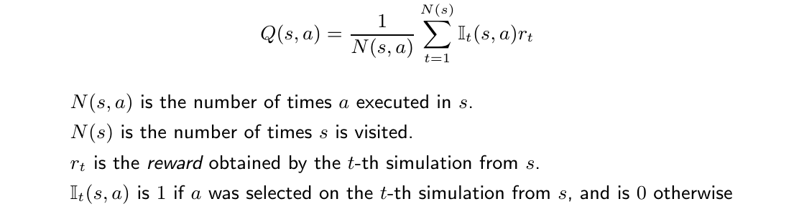
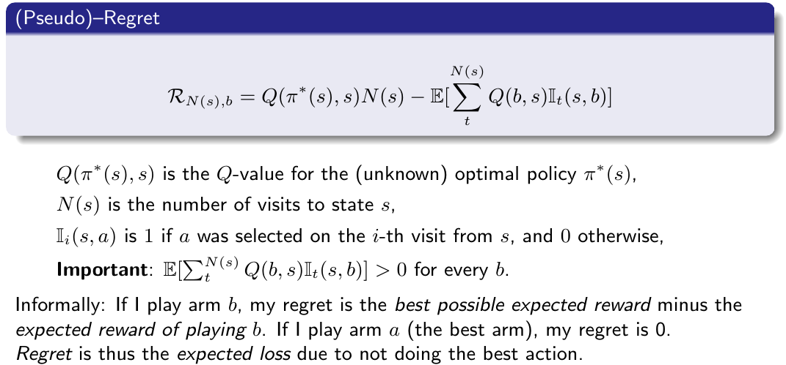
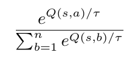
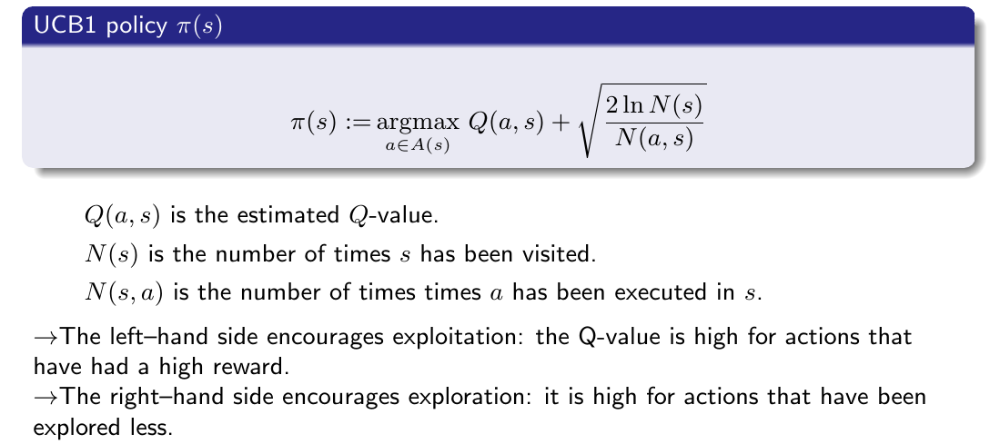
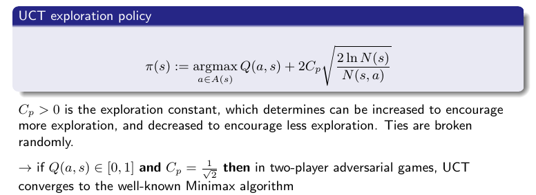

# 10 - Online MDP Planning with Monte Carlo Tree Search
Balancing Exploitation and Exploration

## Offline Planning vs Online Planning
+ Offline Planning
    * value iteration and policy iteration for MDPs are Offline Planning
    * state space _S_ usually far too big
        - ~~poker machine too big to put in MDP~~
        - ~~can approximate the MDP by reducing the dimensionality of _S_ but not discussed in this subject~~
+ Online Planning
    * actions selected online at each state during execution
        - for each visited state, evaluate many policies _π_ (partially)
        - the quality of each π̂ is approximated by averaging the expected reward of trajectories over _S_ obtained by repeated simulations of `r(s, a, s0)`
            + how to do repeated simulations
                * __Monte Carlo__ methods are by far the most popular
                    - get the name by using randomness (chance) to search the action space, like gambling/casinos
        - select the best _π̂_ and execute the action _π̂(s)_

## Monte Carlo Tree Search - basic
+ invoked every time it visits a new state _s_
    * fundamental features
        - The _Q-value_ for each action _a_ at state _s_, `Q(s, a)`, is approximated using random simulation.
        - These estimates of `Q(s, a)` are used to drive a __best-first__ strategy; thus, `Q(s, a)` is being updated while it is also be used as an heuristic in the search.
        - ~~A search tree is built incrementally.~~
        - ~~The search terminates when some pre-defined computational budget is used up, such as a time limit or a number of expanded nodes. Therefore, it is an anytime algorithm, as it can be terminated at any time and still give an answer.~~
        - ~~The best performing action _a_ at _s_ is returned; that is `argmax_{a∈A}{Q(s, a)}`.~~
        - ~~This is complete if there are no dead–ends.~~
        - ~~This is optimal iif the computational budget is sufficient, and is perfect if an entire search can be performed (which is unusual).~~
+ Nodes store tuple <_s_, _a_, pointer to parent, `Q(a, s)`>
    * note that _a_ is the action which is going to be applied on _s_
+ the Algorithm
    * Sketch
        - The evaluated states are stored in a search tree. The set of evaluated states is incrementally built by __iterating__ over the following four steps (expansion and simulation are somehow hybrid):
            + Select
                * ~~Given a tree policy, select a single node in the tree to assess~~
                * happens in __TreePolicy(root)__
                    - Select _recursively_ the most __promising__ node (s, a) to expand
                        + __best-first__
                    - Check if the generated nodes (s0 , b) are already in tree
                    - If not in the search tree, add these nodes to the tree.
                    - Return last node as best
            + Expand
                * ~~Expand this node by applying one available action~~ (actually the corresponding action stored in the tuple)
                    - simulate to get `s-next`
                    - then create nodes for pairs `(s-next , b)`
                        + _b_ ∈ _A_ and executable on _s-next_
                        + would expand the corresponding state for all available actions
                * happens in __DefaultPolicy(best)__
                    - Arbitrary policy _π(s0)_ used to evaluate below node _(s, a)_
                    - ∆ is the maximal reward attained by _π(s0)_
                    - ~~In some applications _π(s0)_ is hand-coded~~
                    - ~~Domain independent version of _π(s0)_: random walk, simulated annealing, ...~~
                    - Think of __DefaultPolicy__ as a __heuristic__
                * How to select the next node to expand in MCTS
                    - The selection of nodes can be considered an instance of the [#_Multi-armed bandit_](#multi-armed-bandit) problem
                        + by using [__#Upper Confidence Trees (UCT)__](#upper-confidence-trees)
                            * __combining MCTS and Multi-armed bandit problem__
            + Simulate
                * From the expanded node, perform a complete random simulation to a leaf node, with probability `P_a{(s, s-next)}` (execute action _a_ from the MDP model in state _s_, choosing state _s-next_ with probability `P_a(s, s-next)`). ~~This therefore assumes that the search tree is finite (but version for infinitely large trees exist).~~
                    - `P_a(s, s0)` is stochastic, so several visits (in theory an infinite number) may be necessary to generate all successors.
                * happens in __DefaultPolicy(best)__
                    - Arbitrary policy _π(s0)_ used to evaluate below node _(s, a)_
                    - ∆ is the maximal reward attained by π(s0)
                    - ~~In some applications _π(s0)_ is hand-coded~~
                    - ~~Domain independent version of _π(s0)_: random walk, simulated annealing, ...~~
                    - Think of __DefaultPolicy__ as a __heuristic__
            + Backpropagate
                * ~~Finally, the value of the node is backpropagated to the root node, updating the value of each ancestor node on the way.~~
                * happens in __Backup(best, ∆)__
                    - ∆ is backpropagated from best to their parents recursively.
                    - a discount factor can be used, as in value iteration, policy iteration, etc.

## Multi-armed bandit
+ given no kwnoledge of the distributions, a simple strategy is simply to select the arm given a uniform distribution for 
    - ~~Flat Monte Carlo (FMC) a.k.a Uniform Sampling~~
        + 
        + issues
            * Sampling Time is wasted equally in all actions using the uniform distribution.
                - Why not focus also on the most promising parts of the tree given the rewards we have received so far? What we want is to play only the good actions; so why not just keep playing the actions that have given us the best reward so far?
                    + However, our selection is randomised, so what if we just haven’t sampled the best action enough times? 
                        * The Fear of Missing Out
                            - an excellent motivator for exploration
                                - [#Exploitation vs Exploration](#exploitation-vs-exploration)

## Exploitation vs Exploration
- regret
    + 
- We seek policies π that minimise regret
    + __e-greedy__
        * choose a random arm with probability e, and choose argmax Q arm with probability (1-e)
        * e around 0.05~0.1 works well
    + e-decreasing
        * same as e-greedy but e decreases overtime
            - ~~A parameter α between [0,1] specifies the decay, such that e := e.α after each action is chosen~~
    + Softmax
        * ~~a _probability matching strategy_~~
            - ~~the probability of each action being chosen is dependent on its Q-value so far~~
                + 
                + ~~τ is the temperature, a positive number that dictates how much of an influence the past data has on the decision~~
    + __Upper Confidence Bounds (UCB1)__
        * A highly effective _multi-armed bandit_ strategy
            - balances exploitation and exploration remarkably well
            - especially in terms of _MCTS_
                + by using [#Upper Confidence Trees](#upper-confidence-trees)
        * 

## Upper Confidence Trees
* treat the selection of nodes to expand in MCTS as a multi-armed bandit problem
* UCT = MCTS + UCB1
* 
* why good
    - addresses _exploitation vs. exploration_comprehensively
        + UCT is systematic
            * Policy evaluation is exhaustive up to a certain depth
            * Exploration aims at minimising regret (or FOMO)
* ~~somtimes not good~~
    - ~~Atari 2600 game Freeway. It fails here because the character does not receive a reward until it reaches the other side of the road, so UCT has no feedback to go on.~~

