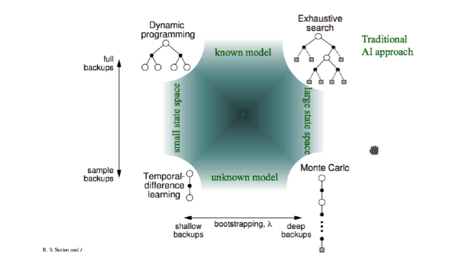
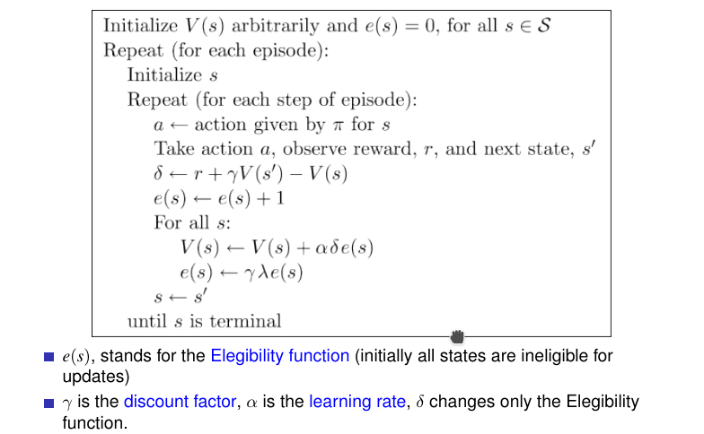
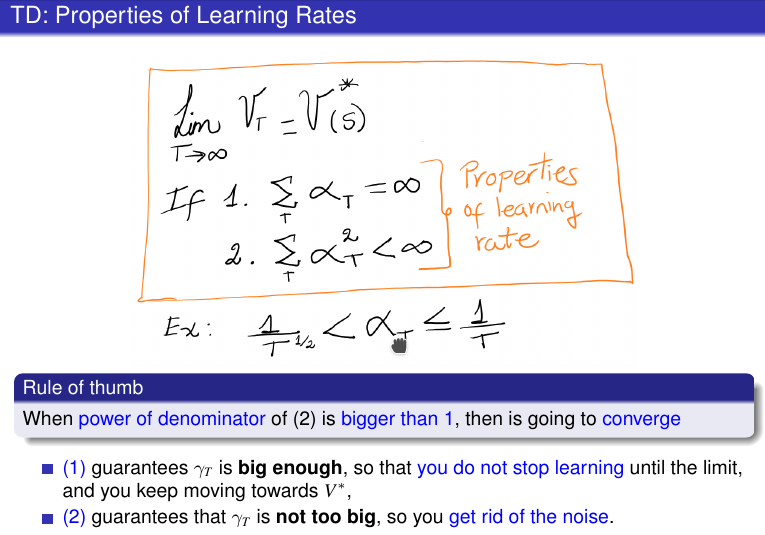

# Reinforcement Learning

How to learn without a model

## Motivation
+ unknown environment
    * you don't have a model
+ Reinforcement Learning
    * Learning + Planning

## Approaches to AI Planning and Learning
+ 

### MCTS vs RL
+ Monte Carlo Tree Search samples a Policy Tree through experience. Recomputes Tree for evey new state.
+ Reinforcement Learning learns a full policy mapping states to actions through experience.

### Reinforcement Learning
+ don't know the environment
+ know the states
+ influence the env with actions, receive feedbacks(rewards)
+ Temporal Difference Learning, TD(λ)
    * Use _experience_ to solve the _prediction_ problem
        - Combination of Monte Carlo (MC) ideas and Dynamic Programming (DP)
            + MC
                * learn from raw experience
                * without a model
            + DP
                * update estimates based on other learned estimates
                * no waiting for final outcome (bootstrap)
        - Predict Expected sum of discounted rewards, by learning over time given < s, a, r > sequences.
        - 
            + learn for the trace
        - 
        - How to update?
            + λ
                * λ = 0, It’s a 1-step update using current prediction of estimated discounted reward
                    - Given finite amount of data (episodes), repeated infinitely often, then TD(0) converges to Maximum Likelihood (ML)
                * λ = 1, It’s a all-step update using the accumulated discounted reward
                * λ = 1/2, It’s a weighted-step update using current prediction of discounted reward

## Summary

### Offline vs Online
+ Offline
    * compute beforehand, may extract the policy for all states
+ Online
    * compute in real time and pick one/the best for the current state
+ know MDP (Stochastic)
    * Offline
        - Value Iteration
        - Policy Iteration
        - compute value&policy beforehand, won't change once done
    * Online
        - Classic Search
            + can be used in offline only when non-stochastic
        - Monte Carlo Search Tree
            + compute new tree each time, old tree useless
+ do not know MDP
    * Offline
        - Reinforcement Learning
            + train itself until being satisfying, then no more update
                * even for TD, computation is done 
                    - TD strongly depends on training data
    * Online
        - Classic Search
            + can be used in offline only when non-stochastic
        - Monte Carlo Search Tree
            + compute new tree each time, old tree useless

### Reinforcement Learning
+ TD
    * look at someone's data to train
+ Sarsa
    * create its own data to train
    * use current q
+ q-learning
    * create its own data to train
    * use max q
    * Q-learning vs SARSA
        - Q-learning is greedy
