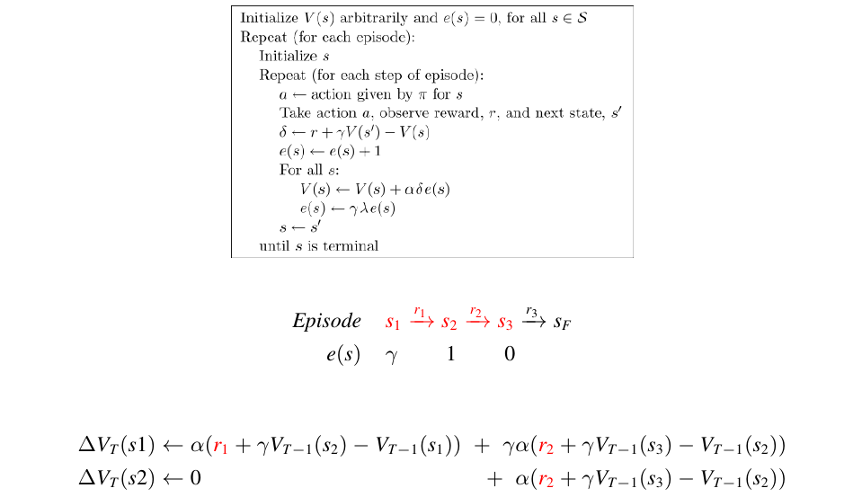
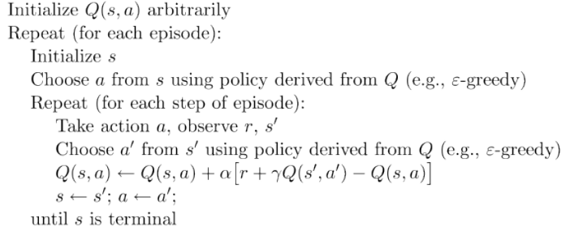
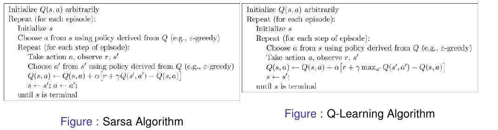

# Reinforcement Learning

How to learn without a model

## Motivation
+ if the description of the world/problem/environment is complete
    * Classical Planning
+ if allow stochasticity but still fully known environments
    * a Stochastic Planning problem (MDP)
+ if deal with __unknown environment__
    * you don't have a model
    * _Special case of (PO)MDP_ where __Probability and Reward distributions__ are unknown
        - Estimating Probability and Reward Distribution
            + Learn from past experience
            + Use a simulator to gain experience
    * a Machine Learning problem
        - __Reinforcement Learning__
            + ≈  Learning + Planning
                * Evaluating Learners
                    - Value of the policy in terms of expected reward
                    - Computational Time
                    - Experience Complexity (time)
                        + How much data/interactions it needs

## Approaches to AI Planning and Learning
+ 

### MCTS vs RL
+ Monte Carlo Tree Search __samples__ a Policy Tree through experience. Recomputes Tree for evey new state.
+ Reinforcement Learning learns a __full__ policy mapping states to actions through experience.

### Reinforcement Learning
+ don't know the environment
+ know the states
    * ~~Environment reveals to agent in the form of a state _s_~~
+ influence the environment with actions, receive feedbacks(rewards)
    * ~~Agent experieces the Environment interacting with it~~
    * ~~rewards _r(s,a)_ explaining the effect of action _a_ applied to state _s_~~
+ Temporal Difference Learning, TD(λ)
    * Use _experience_ to solve the _prediction_ problem
        - Combination of Monte Carlo (MC) ideas and Dynamic Programming (DP)
            + MC
                * learn from raw experience
                * without a model
                    - not using `p(s, a, s')`
                        + MC collects the accumulated V(s) after several simulations
                        + TD uses the V values learned so far (like DP)
                * [MC 的特点](https://www.zhihu.com/question/39916945/answer/209294050)
                    - 每个 action 后不进行更新, 而在 N 轮 simulations 后, 进行更新
                        + ~~因为对于强化学习中的control problem（也就是找一个最优policy）,一般用policy evaluaiton-policy improvement 循环，而如果这样子对ＭＣ来说就是双重循环，运算量极大，所以这里干脆跳出来，整轮游戏后再进行更新~~
                        + 因为回报 G(s) 是与未来的状态中的回报有关的，所以必须要将  N 轮 simulations 结束后才能更新
                        + ~~目前为止，没人证明这样收敛，但确实很好用~~
                    - ~~放弃 policy evaluaiton~~
                        + ~~有时候策略收敛了，但Ｖ(s)仍然没有收敛，干脆放弃~~
                        + ~~目前为止，没人证明这样收敛，但确实很好用~~
                    - 每轮 simulation 随机选 action ,然后从这个 _(s,a)_ 开始模拟
                        + 解决了 DP 中的缺点２，即使状态再多，也没关系，不用全扫
                    - 通过采样平均来代替期望, 从而避开了贝尔曼公式中的转移概率 p(s',r|s,a), 解决了 DP 中的缺点１
                        + Q(s,a) 用 N 轮 simulations 后的在状态 s 进行动作 a 的回报 G(s,a) 的平均近似
                        + V(s) 用 N 轮 simulations 后状态 s 的回报 G(s) 的平均近似
            + DP
                * update estimates based on __other__ learned estimates
                * __no waiting for final__ outcome (bootstrap)
                * [DP 特点](https://www.zhihu.com/question/39916945/answer/209294050)
                    - value/policy iteration 中的转移概率 p(s',r|s,a)在实际情况中不好测量
                    - 当状态量相当大的时候,动态规划里面要对所有状态扫一遍,相当耗代价
            + [DP 是需要模型的(`P(s, a, s')`),而 MC 又要等 N 轮 simulations 后,才能更新,有没有方法将两者结合？](https://www.zhihu.com/question/39916945/answer/209294050)
                * 就是 TD learning 啦
        - Predict Expected sum of discounted rewards, by learning over time given < s, a, r > sequences.
        - TD algo
            + learn from the trace
            + 
        - TD property
            + 
        - TD(1) example
            + 
        - How to update?
            + λ
                * λ = 0, It’s a __1-step update__ using current prediction of estimated discounted reward
                    - Given finite amount of data (episodes), repeated infinitely often, then TD(0) converges to Maximum Likelihood (ML)
                * λ = 1, It’s a all-step update using the accumulated discounted reward
                * λ = 1/2, It’s a weighted-step update using current prediction of discounted reward
+ Sarsa(λ): On-Policy Control TD(λ)
    * Control TD
        - Instead of estimating V for a fixed policy/data
            + Learner makes the choices of what to experience
                *  Exploration vs. Exploitation!
        - Estimates Q^{π}(s, a) state action pairs, for the current behavior policy π
        - Continuously updates the policy π with respect to the current estimate Q
    * On-Policy
        -  Uses the action chosen by the policy for the update!
    * Sarsa(0) algo
        - 
+ Q-learning(λ): Off-Policy Control TD(λ)
    * Off-Policy
        - Ignores the action chosen by the policy, uses the best action argmax_{a'}{Q(s', a')} for the update!
    * Sarsa(0) vs Q-learning(0)
        - 
            + __SARSA__ learns action values relative to the policy it follows
            + __Q-Learning__ learns action values relative to the greedy policy
            + SARSA and Q-Learning converge to optimal policy, even if you are acting suboptimally, but require exploration!
                * e-greedy
                * `argmax_{a'}{(Q(s', a') + f_{exploration}{(s', a')})}`
                    - simple exploration functions
                    - UCB1

## Summary

### Offline vs Online
+ Offline
    * compute beforehand, may extract the policy for all states
+ Online
    * compute in real time and pick one/the best for the current state
+ know MDP (Stochastic)
    * Offline
        - Value Iteration
        - Policy Iteration
        - compute value&policy beforehand, won't change once done
    * Online
        - Classic Search
            + can be used in offline only when non-stochastic
        - Monte Carlo Search Tree
            + compute new tree each time, old tree useless
+ do not know MDP
    * Offline
        - Reinforcement Learning
            + train itself until being satisfying, then no more update
                * even for TD, computation is done 
                    - TD strongly depends on training data
    * Online
        - Classic Search
            + can be used in offline only when non-stochastic
        - Monte Carlo Search Tree
            + compute new tree each time, old tree useless

### Reinforcement Learning
+ TD
    * look at someone's data to train
+ Sarsa
    * create its own data to train
    * use current q
+ q-learning
    * create its own data to train
    * use max q
    * Q-learning vs SARSA
        - Q-learning is greedy
