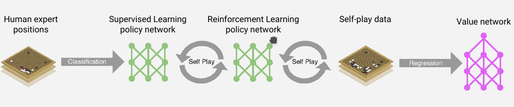

# AlphaGo

## Go is hard
+ Search space is huge
+ hard to evaluate (who is winning)
    * difficult to design evaluation functions

## AlphaGo
+ Monte-Carlo rollouts
    * rollout
        - 反复模拟和采样对局过程
    * 大框架, 算法
        - 非常容易并行
        - 可任何时候停止(时间和收益上的平衡)
        - 引入了随机性采样而减小估值错误带来的负面影响
        - 可在随机探索的过程中, 结合强化学习 (Reinforcement Learning), “自学”式的调整估值函数
+ Reinforcement Learning
    * 学习方法，用来提升AI的实力
+ DNN 是工具, 用来拟合局面评估函数和策略函数, 让"量化评估围棋局面"成为了可能
    * Value network
        - Reducing depth
        - 12 layer convolutional neural network
    * Policy network
        - Reducing breadth
        - 12 layer convolutional neural network
+ 

